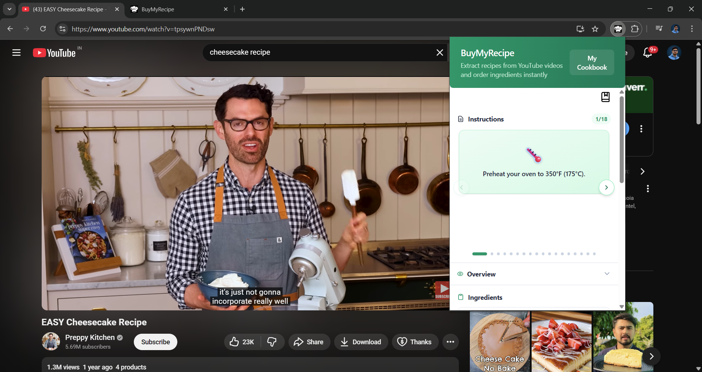
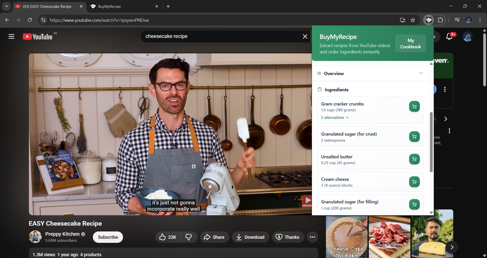
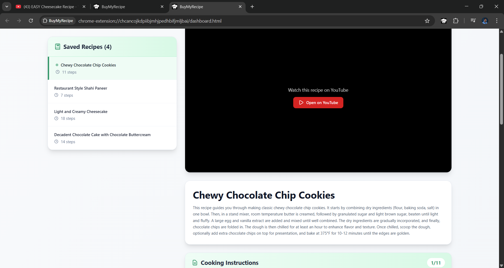
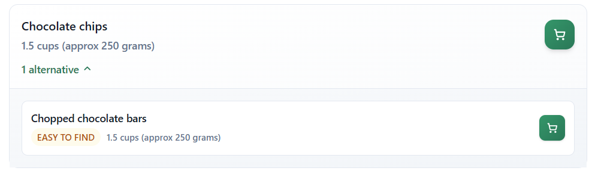

<div align="center">

# **BuyMyRecipe Chrome Extension**


[](https://developer.chrome.com/docs/extensions)
[](https://react.dev/)
[](https://www.typescriptlang.org/)
[](https://tailwindcss.com/)
[](https://firebase.google.com/)
[](https://wxt.dev/)

</div>

---

## **Introduction**

**BuyMyRecipe** is an AI-powered browser extension that transforms how users extract, organize, and shop for recipes directly from YouTube video content. By leveraging Firebase AI Logic's Hybrid AI capabilities, BuyMyRecipe analyzes YouTube cooking videos to extract structured recipe overviews, step-by-step instructions, and exact ingredient lists. Designed with quick-commerce integration for Indian households, it allows users to instantly search for required ingredients on platforms like Blinkit and Zepto, while offering smart substitute suggestions suited for local markets.

This Chrome extension is built using the **Hybrid AI** feature offered by **Firebase AI Logic**.
It fetches details such as the **overview**, **instructions**, and **ingredients** from a YouTube video.

It also offers a feature for the **Indian audience** to find the best suitable ingredients available on **Blinkit** and **Zepto**, relevant to the recipe.

Users can **save recipes** for future reference and access them anytime by opening **“My Cookbook.”**

---

## **Features**

* **🤖 AI-Powered Recipe Extraction**: Automatically extracts overview summaries, step-by-step cooking instructions, and comprehensive ingredient lists directly from YouTube recipe videos using Firebase AI Logic (Hybrid AI).
* **🛒 Quick-Commerce Integration (Blinkit & Zepto)**: Seamlessly search and compare extracted ingredients on popular Indian quick-commerce delivery platforms like Blinkit and Zepto for instant ordering.
* **💡 Smart Ingredient Substitutes**: Recommends healthier, budget-friendly, and locally available Indian market alternatives for hard-to-find ingredients.
* **📖 Digital Cookbook ("My Cookbook")**: Save your favorite extracted recipes locally and access them anytime with full details, instructions, and ingredients.
* **⚡ Modern Tech Stack & UI**: Built with WXT Framework, React 19, TypeScript, and Tailwind CSS for a fast, responsive, and seamless extension user experience.

---

## **Installation**

The installation process can be achieved in three ways:

1. **Direct Installation**
2. **Development Build**
3. **Production Build**

---

### **1. Direct Installation**

1. Clone the repository

   ```bash
   git clone https://github.com/divu050704/BuyMyRecipe.git
   ```

2. Open `chrome://extensions` and load the unpacked extension from
   `.output/chrome-mv3`

---

### **2. Development Build**

1. Clone the repository

   ```bash
   git clone https://github.com/divu050704/BuyMyRecipe.git
   ```

2. Install dependencies

   ```bash
   npm i
   ```

3. Create a `.env` or `.env.development` file from the template `.env.template`

   ```env
   VITE_BACKEND_URL=https://plugin.progardenindia.com
   VITE_API_KEY=
   VITE_AUTH_DOMAIN=
   VITE_PROJECT_ID=
   VITE_STORAGE_BUCKET=
   VITE_MESSAGING_SENDER_ID=
   VITE_APP_ID=
   VITE_MEASUREMENT_ID=
   ```

4. Create the development build

   ```bash
   npm run dev
   ```

5. Open `chrome://extensions` and load the unpacked extension from
   `.output/chrome-mv3-dev`

---

### **3. Production Build**

1. Clone the repository

   ```bash
   git clone https://github.com/divu050704/BuyMyRecipe.git
   ```

2. Install dependencies

   ```bash
   npm i
   ```

3. Create a `.env` or `.env.production` file from the template `.env.template`

   ```env
   VITE_BACKEND_URL=https://plugin.progardenindia.com
   VITE_API_KEY=
   VITE_AUTH_DOMAIN=
   VITE_PROJECT_ID=
   VITE_STORAGE_BUCKET=
   VITE_MESSAGING_SENDER_ID=
   VITE_APP_ID=
   VITE_MEASUREMENT_ID=
   ```

4. Create the production build

   ```bash
   npm run build
   ```

5. Open `chrome://extensions` and load the unpacked extension from
   `.output/chrome-mv3`

---

## **How to Use**

* Open a YouTube video that contains a recipe.
* Click on the **BuyMyRecipe** extension to start the extraction process.

> **Note:** If the extension prompts you to enable captions, try toggling them off and then back on.

---

### **Screenshots**


*Step-by-step instructions generated from the recipe.*


*Option to quickly search and compare products on Blinkit and Zepto.*


*Ingredients used in the recipe.*


*"My Cookbook" page displaying saved recipes and their descriptions.*


*Alternative ingredients suggested by the model, based on easy availability in Indian markets (can also suggest cheaper and healthier options).*

[](https://www.youtube.com/watch?v=_V8wtZmMlNQ)